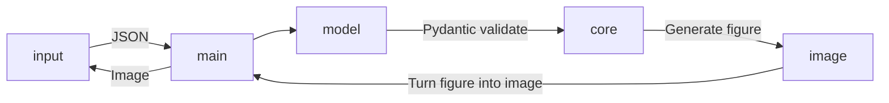

# VisualStat Backend

A Dockerized FastAPI backend service for generating and streaming statistical distribution plots, powered by Matplotlib and SciPy. Hosted on Render: https://visualstat-backend.onrender.com

---

## API Reference

Interact with the service via REST endpoints documented in Swagger UI.

### GET /

- **Description**: Health check 
- **Request**: `GET /`  
- **Response**:    `{"Hello":"World}`

### POST /plot_distribution

- **Description**: Generate and return a distribution plot as a PNG image.  
- **Endpoint**: `POST /plot_distribution`  
- **Content-Type**: `application/json`

#### Request Body Schema

| Field          | Type     | Description                                                                 |
| -------------- | -------- | --------------------------------------------------------------------------- |
| `distribution` | `string` | The type of distribution (e.g., `binomial`,`uniform`) |
| `size`         | `int`    | Number of samples to draw                                                  |
| `show_mean`    | `bool`   | Whether to annotate the mean value on the plot                             |
| n,p, alpha, beta...          | `float`  | Parameters for different distribution                  |


#### Example Request

```json
{
  "distribution": "uniform",
  "size": 10000,
  "show_mean": true,
  "low": 0,
  "high": 1
}
```
## Data flow


## Tech Stack

- **Language & Runtime**  
  - Python 3.10
  - Docker (for container image)  
  - Docker Compose (for local orchestration)  

- **API & Web Server**  
  - FastAPI (web framework)  
  - Uvicorn (ASGI server)  

- **Data Science & Plotting**  
 
  - SciPy (statistical distributions)  
  - Matplotlib (plot generation)  

- **Dependency Management**  
  - `uv` CLI (dependency resolution, lockfiles, virtualenv management)  
  - `pyproject.toml` / `uv.lock`  


---

